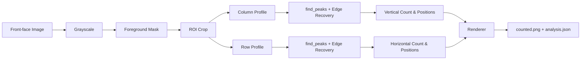

# Rebar Analysis — Algorithm & Solution Overview

**Project:** Construction Rebar Analyzer (`rebar_xray`)  
**Purpose:** Automatically count vertical and horizontal rebar rods from a front-face cage photograph.  
**Approach:** Classical computer vision — no deep learning. Uses 1D intensity projection profiles and peak detection.

---

## Problem

Given a photo of a rebar cage viewed from the front, determine:

- How many **vertical** rods are present
- How many **horizontal** rods are present
- Where each rod is located (pixel coordinates)

The solution must work on real construction-site images where rods appear as dark lines against a light background.

---

## High-Level Pipeline

```
Input Image (BGR)
    → Grayscale conversion
    → Foreground mask (rebar region)
    → ROI bounding box
    → Column profile (vertical bars) + Row profile (horizontal bars)
    → Peak detection on each profile
    → Edge peak recovery
    → Annotated output + JSON results
```

---

## Algorithm (Step by Step)

### 1. Preprocessing — Grayscale & Foreground Mask

Convert the input image to grayscale. Build a binary mask of dark pixels (rebar):

```
mask(x, y) = 1  if  gray(x, y) < T_bg
           = 0  otherwise
```

Default `T_bg = 240`. Apply morphological **closing** (5×5 kernel) to fill small gaps in the mask.

### 2. Region of Interest (ROI)

Compute the bounding box of all foreground pixels in the mask:

```
(x₀, y₀, x₁, y₁) = bounding_box(mask)
```

All further analysis runs on `roi_gray` and `roi_mask` cropped to this box.

### 3. 1D Projection Profiles

Dark pixels are inverted (`255 − gray`) and summed along each axis to produce 1D signals:

| Profile | Computation | Detects |
|---------|-------------|---------|
| **Column profile** `V[x]` | Sum dark pixels in column `x` (axis=0) | Vertical rods |
| **Row profile** `H[y]` | Sum dark pixels in row `y` (axis=1) | Horizontal rods |

Each profile is smoothed with a 1D Gaussian blur. Kernel size scales with image width/height (`max(9, dimension // 60)`).

**Intuition:** Each rebar rod creates a local maximum (peak) in the corresponding profile because more dark pixels concentrate along that line.

### 4. Peak Detection (`scipy.signal.find_peaks`)

Peaks in each profile correspond to individual rods. Two parameters control detection:

| Parameter | Meaning | Default |
|-----------|---------|---------|
| **Prominence** | Minimum peak height relative to surroundings | `0.08 × max(profile)` |
| **Distance** | Minimum spacing between peaks (pixels) | Adaptive (see below) |

#### Adaptive Peak Distance

A coarse first pass finds rough peaks. Spacing between them estimates the true bar pitch:

```
if ≥ 3 rough peaks:
    spacing = percentile(diff(rough_peaks), 25)
else if ≥ 2 rough peaks:
    spacing = median(diff(rough_peaks))

distance = max(min_distance, spacing × 0.55)
```

Fallback: `distance = profile_length // divisor` (7 for vertical, 12 for horizontal).

### 5. Edge Peak Recovery

Rods near the image boundary often have reduced prominence and are missed by standard peak detection. A recovery pass checks the head and tail of the profile:

1. Compute median inter-peak gap and median peak height from detected peaks.
2. **Tail:** Search after the last peak (beyond `0.45 × median_gap`) for a candidate above `0.58 × median_height` with sufficient local prominence.
3. **Head:** Search before the first peak for the same criteria.
4. Accept candidates only if prominence ≥ `0.5 × base_prominence` and distance from nearest peak ≥ `0.45 × median_gap`.

This recovers edge bars that would otherwise be under-counted.

### 6. Coordinate Mapping

Peak indices in the ROI are offset back to full-image coordinates:

```
vertical_positions   = [x₀ + p  for p in v_peaks]
horizontal_positions = [y₀ + p  for p in h_peaks]
```

Counts: `vertical_count = len(vertical_positions)`, `horizontal_count = len(horizontal_positions)`.

### 7. Visualization

Draw on a copy of the input image:

- **Red vertical lines** at each `vertical_positions[i]` (spanning ROI height)
- **Blue horizontal lines** at each `horizontal_positions[i]` (spanning ROI width)
- Numbered labels in gaps between adjacent bars
- Summary banner: `{V}V / {H}H`

### 8. Output Artifacts

| File | Contents |
|------|----------|
| `original.jpg` | Input image copy |
| `counted.png` | Annotated overlay |
| `analysis.json` | Counts, positions, debug metadata |

---

## Architecture



---

## Key Configuration (`CountConfig`)

| Parameter | Default | Role |
|-----------|---------|------|
| `background_threshold` | 240 | Dark-pixel cutoff for mask |
| `prominence_fraction` | 0.08 | Peak prominence threshold |
| `min_peak_distance_px` | 20 | Floor for inter-peak distance |
| `adaptive_peak_distance` | true | Auto-estimate bar spacing |
| `recover_edge_peaks` | true | Recover boundary bars |
| `vertical_distance_divisor` | 7 | Fallback spacing for vertical profile |
| `horizontal_distance_divisor` | 12 | Fallback spacing for horizontal profile |

---

## Usage

**CLI:**
```bash
python rebar_xray/main.py --image input_images/testImage_2.png --output-dir outputs/test
```

**Python API:**
```python
from rebar_xray.pipeline import RebarXRayPipeline
from rebar_xray.config import PipelineConfig

result = RebarXRayPipeline(PipelineConfig()).run("input_images/testImage_1.png")
print(result.payload["bar_counts"])  # {"vertical_rods": N, "horizontal_rods": M}
```

**Notebook:** `notebooks/rebar_analysis_demo.ipynb`

---

## Dependencies

OpenCV (`cv2`), NumPy, SciPy (`find_peaks`, `peak_prominences`). No ML model weights required.

---

## Limitations

- Requires a **front-face** view with rods roughly parallel to image axes.
- Performance degrades with heavy occlusion, extreme perspective, or very low contrast.
- Assumes rods are darker than the background.
